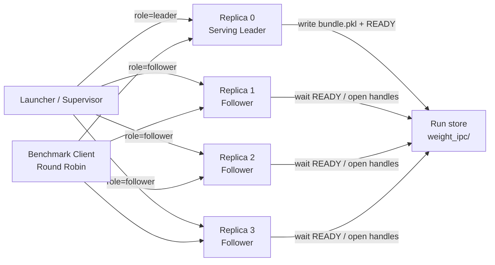

# H100 Higgs CUDA IPC 权重共享 PoC 设计

> 状态：设计草案（与正式设计对齐）  
> 日期：2026-07-18  
> **架构以正式设计为准：** [`docs/design/weight_ipc_same_gpu_dp.md`](docs/design/weight_ipc_same_gpu_dp.md)  
> 关联研究：[`docs/basic_usage/h100_higgs_dp_memory_study.md`](docs/basic_usage/h100_higgs_dp_memory_study.md)  
> 关联路线图：[sgl-project/sglang-omni#921](https://github.com/sgl-project/sglang-omni/issues/921)

本文是正式设计的中文 PoC / benchmark 补充：保留背景、验收矩阵与实施节奏。  
**不得**再引入与正式设计冲突的第二套架构（例如 UDS + `ForkingPickler`、完整 `state_dict` 默认共享）。

## 1. 背景

Higgs TTS 3-4B 在单张 H100 80GB 上使用 CUDA MPS 运行多个同卡 DP replica 时，DP3 后仍存在约 37% SM headroom，但 DP4 在 Equal KV=100000 时无法装入显存。

本仓库现有内存研究得到：

| 项目 | 观测值 |
|---|---:|
| 单 replica 权重 | 约 7.60GB |
| 单 replica KV @ 100000 tokens | 约 13.74GB |
| 单 replica CUDA Graph pool | 约 0.29GB |
| DP4 Equal KV 可运行上界 | 70000–80000 tokens |
| DP4 共享权重的理论节省 | 约 22.8GB |

因此，权重共享的直接价值不是让 DP4 首次能够运行，而是避免 `(N-1)` 份重复权重挤压 KV 空间，使 DP4 有机会恢复到 Equal KV=100000。

另有外部实验图片展示了以下结果，但这些数字尚未在本仓库独立复现：

| 配置 | Unshared | Shared |
|---|---:|---:|
| DP2 显存 | 46GB | 38GB |
| DP3 显存 | 69GB | 53GB |
| DP4 显存 | 91GB，无法装入 | 69GB |
| DP3 throughput | 38.9 req/s | 39.0 req/s |
| DP4 shared throughput | — | 37.6 req/s |
| DP3 shared TTFC p99 @ ~34 req/s | 1.91s | — |
| DP4 shared TTFC p99 @ ~34 req/s | — | 1.53s |

该图片说明的目标趋势是：

1. 权重物理显存从 `N × weights` 下降为 `1 × weights`；
2. DP3 shared 相对 DP3 unshared 基本没有吞吐损失；
3. DP4 shared 不一定提升峰值 QPS，但可能在固定 offered load 下改善 streaming TTFC 尾延迟；
4. leader 与 follower 输出可保持一致。

本设计的目标是用最小但可延伸到生产的实现，在本仓库独立验证上述趋势。

## 2. 决策摘要（已锁定）

PoC / MVP 采用以下设计（与正式设计一致）：

- replica 0 同时作为 serving replica 和 weight owner（leader）；
- replica 1…N-1 作为 followers；
- leader 正常从 checkpoint 加载最终 CUDA 权重；
- followers 对共享参数 **skip-load**（不分配完整本地 CUDA 权重副本），通过 IPC handle 做 `param.data` alias；
- **交换介质：** launcher run 目录下的文件系统 store（`bundle.pkl` + 原子 `READY`），**不用** Unix domain socket；
- **CUDA handle：** PyTorch `UntypedStorage._share_cuda_` / `_new_shared_cuda`（底层 CUDA IPC + refcount），并记录 `allocation_offset_bytes`；一份 bundle 可被多个 follower 打开；leader 在 follower open 期间必须存活；
- **共享范围：** 默认 AR 模块全部 CUDA `named_parameters()`；**不**默认共享完整 `state_dict` / `named_buffers()`；仅在 parity 需要时增加 immutable buffer 白名单；
- **不使用** `ForkingPickler` / `relay_io.ipc_pickle` 作为 weight IPC 路径（含 smoke test）；relay 仅证明短生命周期 stream IPC 可行；
- 权重 alias 必须在 KV profiling / allocation 与 CUDA Graph capture **之前**完成；
- Router 不持有、转发或重新导出 CUDA 权重；launcher 静态分配角色并管理 teardown；
- benchmark 第一阶段对各 replica 端口做 client-side round-robin，避免 Router 成为混杂变量。

集成点优先：

1. `TtsEngineBuilder.build()`：export / import 发生在 `init_device_graphs()` 之前；
2. 模型侧 `load_weights`：follower 对共享名 no-op（skip-load path A）。

不使用全局 monkey patch。过渡期可用 load-then-replace（path B）做正确性，但 **G1（DP4 @ 100k）要求 skip-load**。

## 3. 目标

### 3.1 功能目标

- 同一张 H100 上的多个独立 serving 进程共享一份 Higgs AR 权重；
- follower 不读取共享参数的 checkpoint 权重文件；
- follower 不为共享参数创建完整的本地 CUDA 权重副本；
- 支持现有 MPS、KV pool 和 CUDA Graph 流程；
- leader/follower 输出一致；
- DP4 shared @ Equal KV=100000 可以稳定启动；
- shared 与 unshared benchmark 可以由统一脚本复现。

### 3.2 生产方向目标

PoC 虽然限制范围，但必须保留以下生产边界：

- 显式角色和配置，不依赖隐式选主；
- versioned bundle schema；
- model / device / name_digest 校验；
- import 失败时 fail-closed，不静默退回 checkpoint load；
- leader 生命周期丢失时 followers fail-fast（`LEADER_PID` / generation）；
- run-specific 状态目录（`0700`）；
- 可观测的启动阶段、tensor 数量、logical bytes 和失败原因；
- teardown 先 followers、后 leader、最后 MPS daemon。

### 3.3 Benchmark 目标

- correctness parity；
- card-level 和 process-level 显存；
- DP3 shared/unshared throughput overhead；
- DP3 shared 与 DP4 shared 峰值吞吐；
- 固定 offered load 下的 TTFC p50/p95/p99；
- 结果保存为原始 JSON，图表由独立脚本生成。

## 4. 非目标

第一版明确不支持：

- dedicated weight daemon；
- Unix domain socket 权重导出 / 控制面；
- `ForkingPickler` 权重序列化（含对照实验路径）；
- 默认共享完整 `state_dict` 或全部 buffers；
- Router 自动选主或 Router 持有 CUDA 权重；
- Router 转发或重新导出 CUDA tensor；
- 多节点；
- 多 GPU weight group；
- TP>1；
- quantized model；
- 在线 weight update；
- LoRA merge；
- follower 热重连；
- owner generation 热切换；
- contiguous CUDA weight arena；
- 任意模型的通用支持。

第一版固定范围：

```text
Model: bosonai/higgs-tts-3-4b
Model revision: pinned
GPU: one H100 80GB
Dtype: BF16
TP: 1
Weight target: AR tts_engine
Sharing topology: one serving leader + N-1 followers
Exchange: filesystem bundle + READY
Share default: CUDA named_parameters() only
```

## 5. 为什么 Router 不直接做权重共享

Router 可以负责 control plane，但不能替代 model worker 完成 CUDA export/import：

- CUDA export 必须在拥有原始 CUDA allocation 的进程中执行；
- parameter alias 必须在拥有 `nn.Module` 和 `nn.Parameter` 的 follower 进程中执行；
- HTTP Router 不持有模型对象、参数对象、KV allocator 或 CUDA Graph runner；
- 让 Router 加载 7.6GB 权重会把 CPU Router 与 CUDA/MPS 生命周期不必要地耦合；
- Router crash 将同时影响请求转发和全部共享权重。

PoC 阶段由 launcher 完成静态角色分配，Router 保持不变。

## 6. 架构



## 7. 启动流程

### 7.1 Leader

```text
1. 构建正常 CUDA model 并从 checkpoint 加载权重
2. 按 SharePolicy 导出 named_parameters（+ 可选 buffer 白名单）
3. 对每个 tensor：get handle + storage_offset，写入 WeightIpcBundle
4. 原子写入 bundle.pkl，再创建 READY / LEADER_PID
5. 执行 memory profiling → KV allocation → CUDA Graph capture
6. health ready
```

Leader 不在模型初始化阶段阻塞等待 follower；launcher 在 leader `/health` 且 `READY` 后才启动 followers。

### 7.2 Follower

```text
1. 构建模型壳；对共享参数 skip-load（不读 checkpoint 大权重）
2. wait READY（超时 fail-closed）
3. 加载同一份 bundle.pkl
4. 校验 model_path / revision / name_digest / device
5. open handles，按 offset 重建 tensor，alias 到 param.data
6. 保留 imported storage 强引用
7. 启动 LEADER_PID / generation 监视
8. 执行 memory profiling → KV allocation → CUDA Graph capture
9. health ready
```

## 8. 模型加载集成点

当前链路：

```text
sgl-omni serve
  → TtsEngineBuilder.build()
       → create_sglang_infrastructure_defer_cuda_graph()  # ModelWorker 加载
       → setup_model(...)
       → init_device_graphs()                            # CUDA Graph
```

PoC 要求：

```text
role = resolve_weight_ipc_role(...)
if leader:
    export → store.write → mark_ready
elif follower:
    wait_ready → import_and_alias
# 然后才 init_device_graphs()
```

Follower skip-load 优先落在 Higgs / MOSS-Local 的 `load_weights` 分支。  
细节与类型定义见正式设计 §5–§7。

## 9. 代码结构

新增包（与正式设计一致）：

```text
sglang_omni/distributed/weight_ipc/
  __init__.py
  types.py           # IpcTensorMeta, WeightIpcBundle, WeightIpcRole
  cuda_handles.py    # get/open handle + allocation base/offset
  export.py
  import_.py
  store.py           # filesystem exchange
  select.py          # SharePolicy
  lifecycle.py       # READY, LEADER_PID, failure semantics
```

配置经环境变量 / CLI 进入 typed config，例如：

```bash
WEIGHT_IPC=1
# replica 0:
#   --weight-ipc-role leader --weight-ipc-store $STATE/weight_ipc
# replica i:
#   --weight-ipc-role follower --weight-ipc-store $STATE/weight_ipc
```

## 10. Store 与 Handle（非 UDS / 非 ForkingPickler）

### 10.1 Store 布局

```text
$STATE/weight_ipc/
  bundle.pkl           # WeightIpcBundle（含 handle bytes 与 offset）
  READY                # bundle 持久化后原子创建
  LEADER_PID
  MANIFEST             # schema_version, n_tensors, name_digest
```

权限：目录 `0700`。Leader：`bundle.pkl.tmp` → `os.replace` → 创建 `READY`。  
Followers 轮询 `READY` 后加载**同一份** bundle。

### 10.2 Handle 导出 / 导入

```text
Export (per tensor):
  shared = untyped_storage()._share_cuda_()
  allocation_offset_bytes = data_ptr - cuMemGetAddressRange(data_ptr).base
  record shared fields + shape/stride/dtype + tensor.storage_offset()

Import:
  storage = UntypedStorage._new_shared_cuda(...)
  rebuild tensor view → param.data = ...
  requires_grad = False
```

不要使用 raw `cudaIpcOpenMemHandle` + `_new_with_weak_ptr`（会 segfault）。  
单元测试必须覆盖非零 `allocation_offset_bytes` / `tensor.storage_offset()`。  
传输的是 handle 元数据，不是 7.6GB 权重内容。

### 10.3 与 relay IPC 的边界

| | Relay stream IPC | Weight IPC |
|---|---|---|
| 时机 | 请求 / stream chunk | engine init |
| 介质 | `relay_io` + `ForkingPickler` | FS bundle + 显式 handle |
| 复用 | 无代码复用 | 不调用 `ipc_pickle` / `send_stream_chunk` |

## 11. 共享范围

**默认：** AR 上全部 CUDA `named_parameters()`。

**不默认共享：**

- 完整 `state_dict()`；
- 全部 `named_buffers()`（可能含运行期可变状态，跨 replica 会互相污染）。

**白名单例外：** 若 parameters-only 下 leader/follower 音频 parity 失败，再为确认 immutable 的 persistent buffers 增加显式 FQN 白名单。可变 / non-persistent buffers 保持每 replica 私有。

显存上 buffers 相对 7.6GB parameters 可忽略；范围选择服务于正确性，不是 DP4 头寸。

## 12. 安装方式

优先：

```python
param.data = reconstructed_tensor
param.requires_grad = False
```

保留 imported storage 强引用，防止被 GC。  
若个别模块缓存了 Parameter 对象 identity，调整初始化顺序或在 alias 前完成那些缓存；不引入 `ForkingPickler` 绕过。

完整 `load_state_dict(..., assign=True)` **不是** v1 默认路径（那会鼓励整包 state_dict 共享）。

## 13. Fingerprint / digest

Bundle 至少包含：

```text
schema_version
model_path
model_revision
leader_pid
name_digest          # sorted shared names (+ shapes/dtypes/strides)
physical device 校验  # 拒绝跨 GPU open
```

`name_digest` 不 hash 权重内容。任何不匹配都阻止 follower ready。

## 14. 生命周期与故障语义

### 14.1 Leader liveness

Follower 监视 store 中的 `LEADER_PID` / generation：leader 退出或 PID 变化时 fail-fast（health 失败或进程退出）。  
PoC 不在 owner 丢失后继续推理，也不做热切换。

### 14.2 Fail-closed

以下情况直接使 follower 启动失败：

- READY timeout；
- schema / digest / device mismatch；
- missing/unexpected shared names；
- shape/dtype/stride mismatch；
- CUDA IPC open 失败；
- CUDA Graph capture 失败。

不允许自动 fallback 到完整 checkpoint load。

### 14.3 Teardown

```text
1. 停止接收新请求
2. 停 followers
3. 确认 followers 退出
4. 停 leader
5. 确认 MPS clients 清空
6. 停 MPS daemon
7. 删除 run-specific weight_ipc 状态目录
```

## 15. 可观测性

Leader 最少输出：

```text
weight_ipc: role=leader status=exported n=<N> digest=<hex>
weight_ipc: READY
```

Follower 最少输出：

```text
weight_ipc: role=follower status=aliased n=<N> digest=<hex>
weight_ipc: checkpoint_load_skipped=true   # shared params
weight_ipc: owner_monitor_started=true
```

card-level memory 使用 NVML 或 `nvidia-smi` 单独采样，不能仅依赖 `torch.cuda.memory_allocated()`。

## 16. Launcher

修改 `examples/mps_dp/launch.sh`（及 `mps_dp.md`）：

1. `mkdir -p "$state/weight_ipc" && chmod 700`
2. 启动 replica 0（leader）；等待 `/health` **且** `READY`
3. 顺序启动 followers
4. Equal-KV + MPS attach 检查
5. `down`：followers → leader → MPS

`WEIGHT_IPC=0` 时行为与今日路径完全一致。

## 17. Benchmark 设计

### 17.1 通用固定条件

所有配置必须固定：

- H100 physical GPU；
- NUMA node 和 CPU core blocks；
- private MPS directories；
- model revision；
- SGLang-Omni commit；
- SGLang/PyTorch/CUDA/driver；
- dataset subset；
- `max_new_tokens`；
- sampling 参数和 seed；
- `MAX_TOTAL_TOKENS=100000`；
- CUDA Graph buckets；
- warmup；
- request scheduling policy；
- fresh server policy。

每个配置至少运行 3 次 fresh-server trial，保存所有 trial，不只保存最好值。

### 17.2 Benchmark Client

主 benchmark 绕过 Router，对多 replica 端口做 deterministic round-robin。  
Router benchmark 作为第二组数据，不用于判断 weight sharing 本身的 overhead。

### 17.3 Correctness

```text
DP2 shared
concurrency=1
30 个固定样本
固定 decoding 参数
```

比较 leader vs follower：token sequence、completion token count、decoded PCM SHA256、audio length、失败率。

目标：`30/30` token identical 且 PCM bit-identical（或文档化的容差）。  
先在 **parameters-only** 下跑 parity；若失败再评估 buffer 白名单。

### 17.4 Memory

| 配置 | 预期趋势 |
|---|---|
| DP2 unshared | 约 46GB |
| DP2 shared | 约 38GB |
| DP3 unshared | 约 69GB |
| DP3 shared | 约 53GB |
| DP4 unshared | OOM；理论约 91GB |
| DP4 shared | 约 69GB |

采样阶段：baseline → after materialization → after KV → after CUDA Graph → all ready → steady state。  
DP4 unshared 的 91GB 是外推值，不得伪装为实际稳态观测。

### 17.5 Sharing Overhead

比较 DP3 unshared vs DP3 shared；concurrency sweep 如 `32, 64, 96, 128`。  
目标：DP3 shared peak throughput 位于 DP3 unshared 的 ±2% 内（与正式设计 G2 一致）。

### 17.6 DP3 vs DP4 Peak Throughput

记录 aggregate / per-replica QPS、e2e latency、SM Active、DRAM、CPU、queue depth。  
不要求 DP4 QPS 高于 DP3。

### 17.7 TTFC

使用仓库指标：client send → first audio chunk（`audio_ttfp_*`）。  
固定 offered load（如 34 req/s）比较 DP3 shared vs DP4 shared 的 p50/p95/p99；建议 ≥1000 成功请求再报 p99。

## 18. 测试分层

### 18.1 CPU / 单元

- store READY 原子性与 timeout；
- digest / device mismatch；
- invalid role；
- stale store cleanup；
- shape/dtype/stride validation；
- **`storage_offset_bytes != 0` round-trip**（可用 mock FFI）。

### 18.2 CUDA Smoke（两进程，显式 handle，不用 ForkingPickler）

- get/open handle + offset；
- tied weight（共享 storage）；
- `param.data` alias；
- forward parity；
- leader 退出后 follower fail-fast；
- MPS on/off。

### 18.3 H100 Manual / Integration

- Higgs leader/follower skip-load；
- DP2 correctness；
- DP3 memory saving；
- DP4 shared @ 100k startup；
- CUDA Graph；
- throughput / TTFC；
- repeated startup/teardown；
- owner failure。

## 19. Go/No-Go 标准

### 功能

- DP4 shared @ Equal KV=100000 连续 3 次 fresh launch 成功；
- followers 对共享参数完全跳过 checkpoint weight load；
- CUDA Graph capture/replay 成功；
- leader/follower correctness parity 满足预设标准。

### 显存

- DP3 shared 相比 DP3 unshared 至少节省约 14GB；
- DP4 shared 最终 card-level memory 不高于 72GB；
- 符合 `1 × weights + N × private` 趋势。

### 性能

- DP3 shared throughput 相比 DP3 unshared 退化不超过 2%；
- 报告 DP4 shared 峰值 QPS，不要求其高于 DP3；
- 固定 offered load 下报告 TTFC p50/p95/p99；
- 如果 DP4 p99 改善低于 10%，需重新评估产品价值。

### 生命周期

- leader crash 后 followers 在限定时间内 fail-fast；
- teardown 后无残留 followers、MPS clients 或 weight_ipc 状态；
- import mismatch 不产生 silent fallback。

### 可复现性

- 所有环境、命令和原始 JSON 可追溯；
- 每个关键配置至少 3 次 fresh run；
- benchmark 图表可以由保存的 JSON 重建。

## 20. 实施阶段

与正式设计 Phase 0–4 对齐：

| Phase | 内容 | Exit |
|---|---|---|
| 0 | `cuda_handles` + 两进程 GPU smoke | ✅ 已完成 |
| 1 | export / import / store / `ArParametersPolicy` | ✅ 已完成 |
| 2 | CLI + `load_model` hook + Higgs follower + `launch.sh` + H100 G1/G3 | ✅ **Go**（见下） |
| 3 | DP3 U/S、DP4 S 吞吐与 TTFC；更新 `mps_dp.md` | ✅ 已完成（见下） |
| 4 | （可选）MOSS-TTS Local | 独立重测，不复用 Higgs token 上限 |

### H100 实测（2026-07-18）

| 检查 | 结果 |
|---|---|
| DP2 shared @ KV=100000 | 启动成功；MPS attach OK |
| DP2 leader/follower WAV SHA256 | **30/30 bit-identical** |
| DP4 shared @ KV=100000 | 4/4 replica `#tokens: 100000` |
| DP4 卡级显存 | ~70–71 GB |
| 进程显存（约） | leader ~23.4 GB；follower ~15.6 GB ×3 |

**Phase 3 吞吐 / TTFC**（SeedTTS EN generate-only + stream，每 replica 一 client，`c=64`；产物目录 `results/weight_ipc_phase3_20260718-091621/`）：

| Config | Aggregate QPS | TTFC p99 |
|---|---:|---:|
| DP3 unshared peak | 28.15 | 5.53s（饱和） |
| DP3 shared peak | **29.86（+6.1%）** | 5.16s（饱和） |
| DP3 shared @ ~34 offered | 29.09 | **0.51s** |
| DP4 shared peak | **35.15** | 5.45s（饱和） |
| DP4 shared @ ~34 offered | 30.83 | 0.61s（本轮未优于 DP3） |

**G2：** pass（shared 无 >2% 吞吐退化；本轮甚至更快）。DP4 峰值 QPS 更高；matched-load TTFC 优势未在本轮复现。

辅助脚本：

```bash
export PATH=/path/to/.venv/bin:$PATH
export PYTHONPATH=$PWD
GPU_ID=0 CORE_BLOCKS="0-7 8-15" \
  bash examples/weight_ipc/run_h100_go_nogo.sh dp2-parity
GPU_ID=0 \
  CORE_BLOCKS_DP3="0-7 8-15 16-23" \
  CORE_BLOCKS_DP4="0-7 8-15 16-23 24-31" \
  bash examples/weight_ipc/run_phase3_perf.sh
```

## 21. 主要风险

| 风险 | 缓解 |
|---|---|
| Skip-load 需要 Omni/`load_weights` 钩子 | 优先模型侧分支；path B 仅用于早期 parity |
| CUDA Graph 不接受 mapped storage | alias 后再 capture；必要时 graph off 对照 |
| MPS 多读者不稳定 | Phase 0 强制验证并记录驱动约束 |
| `storage_offset != 0` 处理错误 | 单元测试强制覆盖 |
| 可变 buffer 被误共享 | 默认 parameters-only + 显式白名单 |
| Leader 退出使 group 失效 | PoC 接受 group restart；PID fail-fast |
| DP4 仅改善 TTFC 不提升 QPS | 由 Go/No-Go 决定是否产品化 |

## 22. Open Questions

与正式设计 §16 一致，PoC 侧优先关闭：

1. FFI：纯 Python CUDA binding 还是小扩展模块？
2. parameters-only 下 Higgs 是否已 30/30 bit-identical？若否，白名单需要哪些 immutable buffers？
3. CUDA Graph 在 imported storage 上是否稳定 replay？
4. Router 介入后 DP4 TTFC 优势是否仍在？

## 23. 文档关系

| 文档 | 角色 |
|---|---|
| [`docs/design/weight_ipc_same_gpu_dp.md`](docs/design/weight_ipc_same_gpu_dp.md) | **架构与模块权威** |
| 本文 `cudaIpc.md` | 中文 PoC / benchmark / Go-No-Go 补充 |
| [`docs/basic_usage/h100_higgs_dp_memory_study.md`](docs/basic_usage/h100_higgs_dp_memory_study.md) | 显存测量 |
| [`docs/basic_usage/mps_dp.md`](docs/basic_usage/mps_dp.md) | MPS DP 操作手册 |
