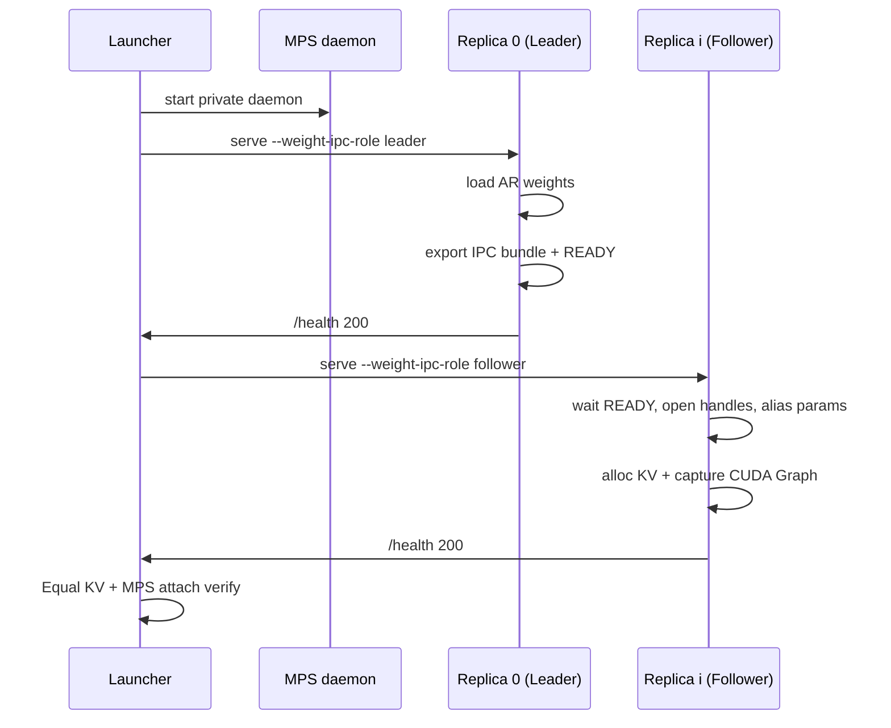

# CUDA IPC Weight Sharing for Same-GPU DP

> Status: design draft  
> Tracking: [#921](https://github.com/sgl-project/sglang-omni/issues/921) (Router & Same-GPU DP), [#1056](https://github.com/sgl-project/sglang-omni/issues/1056) (CUDA IPC memory study), [#1052](https://github.com/sgl-project/sglang-omni/issues/1052)  
> Companion measurement: [`docs/basic_usage/h100_higgs_dp_memory_study.md`](../basic_usage/h100_higgs_dp_memory_study.md)  
> Companion recipe: [`docs/basic_usage/mps_dp.md`](../basic_usage/mps_dp.md)  
> Companion PoC / benchmark notes: [`cudaIpc.md`](../../cudaIpc.md) (must stay consistent with this doc)

### Locked decisions (MVP)

| Topic | Decision |
|---|---|
| Exchange medium | Filesystem store: `bundle.pkl` + atomic `READY` under the launcher run dir. **No** Unix-domain socket control plane for weight export. |
| CUDA handle path | PyTorch `UntypedStorage._share_cuda_` / `_new_shared_cuda` in `cuda_handles.py` (CUDA IPC under the hood, plus ref-counting). Also record `allocation_offset_bytes` via `cuMemGetAddressRange` for diagnostics/tests. Not raw `OpenMemHandle`+weak pointer (segfaults) and not `ForkingPickler`. |
| Share scope | Default: all CUDA `named_parameters()` on the AR module. Buffers are **not** shared by default; add an explicit immutable-buffer whitelist only if leader/follower parity requires it. |
| Out of scope for weight IPC | `ForkingPickler` / `relay_io.ipc_pickle` — including smoke tests. Relay proves short-lived stream IPC; weight IPC does not reuse that serializer. |

## Table of contents

1. [Context and motivation](#1-context-and-motivation)
2. [Goals and non-goals](#2-goals-and-non-goals)
3. [Success criteria](#3-success-criteria)
4. [Architecture](#4-architecture)
5. [Module design](#5-module-design)
6. [Integration with the AR startup path](#6-integration-with-the-ar-startup-path)
7. [Follower load strategy](#7-follower-load-strategy)
8. [Launcher changes](#8-launcher-changes)
9. [Correctness model](#9-correctness-model)
10. [Testing plan](#10-testing-plan)
11. [Implementation phases](#11-implementation-phases)
12. [CLI and configuration](#12-cli-and-configuration)
13. [Risks and mitigations](#13-risks-and-mitigations)
14. [PR split](#14-pr-split)
15. [Boundary with existing CUDA IPC](#15-boundary-with-existing-cuda-ipc)
16. [Open questions](#16-open-questions)

---

## 1. Context and motivation

Same-GPU data parallelism runs several complete serving replicas on one GPU and uses [CUDA MPS](https://docs.nvidia.com/deploy/mps/index.html) so their kernels can overlap. Today each replica loads its own copy of the model weights:

```text
VRAM ≈ N × Weights + N × KV(T) + N × Graph + Other
```

On H100 with Higgs TTS 3-4B, startup-log accounting ([#1056](https://github.com/sgl-project/sglang-omni/issues/1056)) shows roughly:

| Component | Size |
|---|---:|
| AR weights | ~7.60 GB |
| KV @ 100000 tokens | ~13.74 GB |
| CUDA Graph pool (`bs=1..64`) | ~0.29 GB |

Observed Equal-KV feasibility:

| Config | Equal KV `T` | Result |
|---|---:|---|
| DP3 | 100000 | fits (recipe) |
| DP4 | 70000 | fits |
| DP4 | 80000 / 100000 | fails Equal-KV check |

So DP4 is not impossible because four weight copies alone refuse to load; the binding failure at the interesting target (DP4 with Equal KV aligned to the DP3 recipe) is **KV headroom after N× weight replication**. Sharing one weight copy across replicas frees about `(N-1) × 7.6 GB` and is the lever to push Equal KV from ~70k toward 100k+.

Independent experiments on Higgs (leader export / follower `param.data` alias) also reported: unshared DP4 ~91 GB (does not fit), shared DP4 ~69 GB; DP3 shared vs unshared throughput within noise; DP4 shared improves TTFC p99 under matched load. That work is **not** the same as the existing relay CUDA-IPC path and is not yet an upstream product feature.

Roadmap wording in [#921](https://github.com/sgl-project/sglang-omni/issues/921): applying CUDA IPC to **weight tensors at engine init** is new work. The relay data plane ([#869](https://github.com/sgl-project/sglang-omni/pull/869) / [#941](https://github.com/sgl-project/sglang-omni/pull/941)) only proves process-shared GPU memory is already used for **stream/activation transport**.

---

## 2. Goals and non-goals

### Goals

| ID | Description |
|---|---|
| G1 | H100 Higgs: DP4 + weight sharing + Equal KV `MAX_TOTAL_TOKENS=100000` starts cleanly with MPS attach verified |
| G2 | DP3 shared vs unshared: aggregate throughput within ~2% (“sharing costs nothing”) |
| G3 | Leader vs follower: same inputs produce bit-identical audio (or a documented numeric tolerance) |
| G4 | AR sharing mechanism is model-agnostic at the library layer; Higgs first, MOSS-TTS Local pluggable |

### Non-goals (v1)

- Sharing KV cache, CUDA Graph pools, or per-request state
- Mandating encoder / vocoder / codec weight sharing (optional v2)
- Router changes (orthogonal; see [#1049](https://github.com/sgl-project/sglang-omni/pull/1049))
- Replacing single-worker host-path optimization (workstreams 1 and 5 on [#921](https://github.com/sgl-project/sglang-omni/issues/921) / [#1052](https://github.com/sgl-project/sglang-omni/issues/1052))

---

## 3. Success criteria

Ship / recommend the feature only when all of the following hold on the pinned Higgs + H100 setup:

1. `WEIGHT_IPC=1` DP4 with `MAX_TOTAL_TOKENS=100000` passes launcher Equal-KV and MPS attach checks.
2. Saturated DP3 shared QPS is within ~2% of DP3 unshared.
3. Leader/follower audio parity: 30/30 bit-identical (or agreed tolerance) on a fixed prompt set.
4. Default path remains `weight-ipc-role=off` with no behavior change.

Optional product signal (from prior experiments): under matched load (~same req/s), DP4 shared TTFC p99 is no worse than DP3 shared (often better due to more replicas, not because IPC speeds kernels).

---

## 4. Architecture

### 4.1 Roles

| Role | Process | Behavior |
|---|---|---|
| **Leader** | replica 0 | Load AR weights from disk → export CUDA IPC handle bundle → allocate private KV/Graph → serve |
| **Follower** | replica 1..N-1 | **Skip** disk load for the shared parameter set → open handles → alias `param.data` → private KV/Graph → serve |
| **Off** | default | Current behavior; no IPC |

Do **not** reuse the pipeline TP names `role=leader|follower` from `stage_workers`. Use `weight_ipc_role` everywhere in this feature.

### 4.2 Runtime layout

```text
┌──────────────────────────── One GPU ────────────────────────────┐
│  [AR Weights ×1]  ←── cudaIpc map (read-mostly) ──┐             │
│         ↑                                          │             │
│      Leader                                 Follower × (N-1)     │
│      KV_L, Graph_L, Enc/Vocoder_L…          KV_i, Graph_i, …     │
└──────────────────────────────────────────────────────────────────┘
```

### 4.3 Startup sequence (strict)

```text
1. Private MPS daemon ready
2. Start Leader (weight_ipc_role=leader, store=$RUN/weight_ipc)
3. Leader: load → export bundle → atomic READY → /health 200
4. Start Followers sequentially (same store)
5. Each Follower: wait READY → import/alias → KV + CUDA Graph → /health 200
6. Equal-KV check + MPS attach verification
7. Traffic (per-replica clients and/or Router)
```

### 4.4 Teardown sequence (strict)

```text
1. Stop Followers first
2. Stop Leader
3. Stop MPS daemon
```

Stopping MPS or Leader while Followers still map weight storage risks `cudaErrorMpsRpcFailure` and undefined mapped memory. Align with the teardown discipline already documented in [`mps_dp.md`](../basic_usage/mps_dp.md).



---

## 5. Module design

### 5.1 Proposed package layout

```text
sglang_omni/distributed/weight_ipc/
  __init__.py
  types.py           # IpcTensorMeta, WeightIpcBundle, WeightIpcRole
  cuda_handles.py    # get/open handle + allocation base/offset
  export.py          # Leader: named parameters → bundle
  import_.py         # Follower: open + alias into nn.Parameter
  store.py           # filesystem exchange for one run
  select.py          # SharePolicy: which parameters are shared
  lifecycle.py       # READY, leader PID, failure semantics
```

Keep this separate from `sglang_omni/pipeline/relay_io.py`. Relay IPC is a short-lived transport for stream chunks; weight IPC is long-lived parameter storage shared at init. Do **not** call `ipc_pickle` / `ForkingPickler` from the weight path — implement handles and offsets explicitly so multi-follower open of one durable bundle stays well-defined and testable.

### 5.2 Core types

```python
@dataclass(frozen=True)
class IpcTensorMeta:
    name: str                      # stable FQN, e.g. "model.layers.0.self_attn.qkv_proj.weight"
    shape: tuple[int, ...]
    stride: tuple[int, ...]        # reject or explicitly handle non-contiguous layouts
    dtype: str                     # e.g. "torch.bfloat16"
    nbytes: int
    device_index: int              # after CUDA_VISIBLE_DEVICES remapping
    handle: bytes                  # serialized cudaIpcMemHandle
    storage_offset_bytes: int      # data_ptr - allocation_base
    requires_grad: bool            # expect False for serving

@dataclass
class WeightIpcBundle:
    schema_version: int            # start at 1
    model_path: str
    model_revision: str | None
    cuda_driver: str | None
    created_unix_s: float
    leader_pid: int
    tensors: list[IpcTensorMeta]
    name_digest: str               # hash of sorted shared names (+ shapes/dtypes/strides; includes whitelist buffers if any)
```

### 5.3 Store protocol (v1: same host, filesystem)

Under the launcher run state directory, e.g. `$STATE/weight_ipc/`:

```text
weight_ipc/
  bundle.pkl           # full WeightIpcBundle including handle bytes
  READY                # created atomically after bundle is durable
  LEADER_PID
  MANIFEST             # schema_version, n_tensors, name_digest (human-readable)
```

Rules:

- Directory mode `0700` (same trust model as the private MPS pipe dir).
- Leader writes `bundle.pkl.tmp` then `os.replace` to `bundle.pkl`, then creates `READY`.
- Followers poll for `READY` (timeout configurable), then load the **same** bundle. One durable handle set is opened by each follower (no per-consumer re-export).
- v1 does not use a socket or `ForkingPickler`; the launcher already starts replicas sequentially and waits on `/health` + `READY`.
- Leader liveness is via `LEADER_PID` / generation in the store (poll or watch), not a persistent UDS control connection.

### 5.4 CUDA handle layer (critical)

PyTorch’s caching allocator routinely places tensors at a non-zero offset inside a block. Weight IPC records both:

- `allocation_offset_bytes = data_ptr - cuMemGetAddressRange.base` (diagnostics / tests)
- PyTorch storage IPC fields from `UntypedStorage._share_cuda_()` (`handle`, `storage_offset_bytes`, ref-counter, event)

**Export (per tensor):**

```text
1. shared = tensor.untyped_storage()._share_cuda_()
2. allocation_offset_bytes = data_ptr - cuMemGetAddressRange(data_ptr).base
3. record shared fields + shape/stride/dtype + tensor.storage_offset()
```

**Import:**

```text
1. storage = UntypedStorage._new_shared_cuda(...)
2. rebuild tensor view (shape/stride/tensor_offset)
3. param.data = reconstructed_tensor   # read-mostly alias
4. param.requires_grad = False
```

Implementation notes:

- Do **not** use `ForkingPickler` / `relay_io.ipc_pickle`.
- Do **not** use raw `cudaIpcOpenMemHandle` + `UntypedStorage._new_with_weak_ptr` (prototyped; segfaults on current PyTorch).
- Leader process must remain alive until followers have opened handles (and for the serving lifetime).
- Unit tests **must** cover non-zero `allocation_offset_bytes` / `tensor.storage_offset()`.
- Serving paths must not in-place mutate shared weights.

### 5.5 Share policy

```python
class SharePolicy(Protocol):
    def select(
        self, model: torch.nn.Module
    ) -> list[tuple[str, torch.Tensor]]:  # Parameters and optional whitelisted buffers
        ...
```

**v1 — `ArParametersPolicy`**

- Input: the AR module at `model_worker.model_runner.model` after load (Leader) or after shell construction (Follower).
- Share by default: all CUDA `named_parameters()`.
- **Do not** share the full `state_dict()` and **do not** share `named_buffers()` by default.
  - Buffers may be mutated at runtime (codebook counters, caches, etc.); sharing them would cross-contaminate replicas.
  - On Higgs AR, VRAM savings from buffers are negligible vs ~7.6 GB parameters; scope is about correctness, not DP4 headroom.
- Optional: an explicit **immutable buffer whitelist** (FQN list or tiny allow-policy) only if leader/follower audio parity fails without those buffers. Mutable / non-persistent buffers stay private per replica (local init or local small load).
- Exclude: any tensor known to be mutated at runtime during serve.

**v2 — optional policies**

- Include selected codec/encoder/vocoder modules.
- Not the default; enable only after AR-only DP4@100k is proven and further VRAM is still needed.

Why AR first: it is the largest fixed per-replica cost (~7.6 GB on Higgs), loads through a single `TtsEngineBuilder` path shared by Higgs and MOSS-Local, and is read-only during serve.

---

## 6. Integration with the AR startup path

### 6.1 Current chain

```text
sgl-omni serve
  → pipeline stages
  → TtsEngineBuilder.build()          # sglang_omni/scheduling/engine_factory.py
       → create_sglang_infrastructure_defer_cuda_graph()
            → ModelWorker(...)        # load weights + KV pool
       → setup_model(...)
       → init_device_graphs()          # CUDA Graph capture
       → scheduler / model_runner wiring
```

### 6.2 Hook placement

Alias **must** complete **before** `init_device_graphs()`. Pseudocode for `TtsEngineBuilder.build()`:

```text
want_cuda_graph, infra = create_sglang_infrastructure_defer_cuda_graph(...)
model = model_worker.model_runner.model
setup_model(...)

role = resolve_weight_ipc_role(args/env)
if role == leader:
    bundle = export_shared_weights(model, policy=ArParametersPolicy())
    store.write(bundle)
    store.mark_ready()
elif role == follower:
    store.wait_ready(timeout)
    import_and_alias(model, store.load())
    # if using load-then-replace transitional path: free displaced storages here

if want_cuda_graph:
    model_worker.model_runner.init_device_graphs()
```

Each replica still captures its **own** CUDA Graph over the aliased weights. Graphs are not shared.

### 6.3 Where KV fits

- Leader: load weights → export → (existing) memory profile / KV alloc.
- Follower (skip-load path): no large private weight allocation → more free memory at profile time → can satisfy Equal KV 100k when the card would otherwise fail.
- Launcher continues to require `#tokens == MAX_TOTAL_TOKENS` for `N > 1`.

Sequential start still means Followers see memory already reserved by the Leader (one weight copy + Leader KV/Graph). The win is avoiding `(N-1)` additional weight copies.

---

## 7. Follower load strategy

| Path | Behavior | Pros | Cons |
|---|---|---|---|
| **A. Skip-load (target)** | Follower does not allocate real GPU storage for shared params; only shells + IPC import | Correct peak VRAM; required for G1 | Needs a clean hook in Omni/SGLang load |
| **B. Load-then-replace (transition)** | Full load → alias → delete old storage / `empty_cache()` | Smaller code change for early correctness tests | Peak still ~2× weights; may still OOM on DP4 |

**Policy:** Phase 0–1 may use B to prove numeric identity. **G1 (DP4 @ 100k) requires A or an equivalent “no double allocate” path.**

Preferred Omni-side approach for A: branch inside model-specific `load_weights` (Higgs / MOSS-Local already implement this) so Follower no-ops shared names and only materializes non-shared tensors. Evaluate `ModelWorker` / upstream SGLang hooks only if `load_weights` is insufficient.

---

## 8. Launcher changes

File: `examples/mps_dp/launch.sh` (and docs in `mps_dp.md`).

New environment:

```text
WEIGHT_IPC=0|1                 # default 0
# When WEIGHT_IPC=1:
#   replica 0:  --weight-ipc-role leader  --weight-ipc-store $state/weight_ipc
#   replica i:  --weight-ipc-role follower --weight-ipc-store $state/weight_ipc
```

Behavioral changes:

1. `mkdir -p "$state/weight_ipc" && chmod 700`
2. Start replica 0; wait for `/health` **and** `$state/weight_ipc/READY`
3. Start replicas 1..N-1 as followers
4. Keep Equal-KV and MPS attach checks
5. On `down`, stop replicas in reverse order (followers then leader), then MPS

Suggested log lines for automation:

```text
weight_ipc: role=leader status=exported n=<N> digest=<hex>
weight_ipc: role=follower status=aliased n=<N> digest=<hex>
weight_ipc: READY
```

---

## 9. Correctness model

Invariants:

1. **Read-mostly weights:** serving must not write shared `param.data`.
2. **Same physical GPU:** resolve UUIDs / `CUDA_VISIBLE_DEVICES`; reject cross-GPU open.
3. **Graph-after-alias:** CUDA Graph capture only after import completes.
4. **Version match:** Follower refuses bundles whose `model_path` / revision / `name_digest` disagree with local config.
5. **Leader liveness:** if Leader dies, Followers must fail loudly (health fail or process exit), never silently continue on dead mappings.
6. **No silent fallback:** missing READY, digest mismatch, or IPC open failure aborts startup.

---

## 10. Testing plan

| Layer | What |
|---|---|
| Unit | Offset ≠ 0 round-trip; digest mismatch rejected; cross-GPU rejected |
| Two-process PoC | Shared Linear (or one real layer); matmul bitwise/allclose; MPS on/off |
| Serving correctness | Higgs: fixed prompts; leader vs follower 30/30 bit-identical audio |
| Memory | DP4 shared @ 100k Equal KV passes; unshared @ 100k still fails; record `nvidia-smi` + log breakdown |
| Performance | DP3 unshared vs shared QPS; DP4 shared QPS; matched-load TTFC p50/p95/p99 |
| Regression | `WEIGHT_IPC=0` identical to today’s path |

Load generation recommendations:

- Primary: **one client per replica** (same discipline as the MPS case study) so Router variance does not confound backend results.
- Optional: second series through Omni Router.

TTFC meaning (repo metrics): client send → first audio chunk (`audio_ttfp_*` in `benchmarks/metrics/performance.py`). Matched-load comparisons should hold completed req/s nearly equal across configs before comparing percentiles.

---

## 11. Implementation phases

### Phase 0 — CUDA IPC primitive (2–4 days)

- [x] `cuda_handles.py` share/open + `allocation_offset_bytes` (**not** `ForkingPickler`)
- [x] Two-process CUDA e2e in `tests/unit_test/distributed/test_weight_ipc_cuda.py` (forward parity + non-zero `allocation_offset_bytes`)
- [x] Document constraint: leader must stay alive for open/use; raw weak-ptr wrap unsafe

**Exit:** Follower computes with Leader’s storage; values match.

### Phase 1 — Export / import / store (3–5 days)

- [x] `export` / `import_` / `store` / `ArParametersPolicy` (+ lifecycle helpers)
- [x] Unit tests (`tests/unit_test/distributed/`)

**Exit:** Arbitrary `nn.Module` can dump/load aliases via the store.

### Phase 2 — Higgs integration (1–2 weeks)

- [x] CLI flags (`--weight-ipc-role` / `--weight-ipc-store`) + env resolve
- [x] Hook in `SGLModelRunner.load_model` **before** KV profiling (`init_memory_pool`), not only before CUDA Graph
- [x] Follower uses `load_format=dummy` + import/alias; Higgs `load_weights` no-ops when follower
- [x] `launch.sh` `WEIGHT_IPC=1` mode (leader READY gate; teardown followers first)

**Exit:** G1 + G3 — **met on H100 (2026-07-18)** (see Appendix C).

**Note:** Follower still briefly materializes dummy CUDA parameter shells before alias+`empty_cache`. On the measured H100 Higgs run this did **not** block DP4@100k.

### Phase 3 — Performance and docs (3–5 days)

- [x] DP3 U/S and DP4 S throughput + TTFC tables (see Appendix C)
- [x] Update `mps_dp.md` with an optional weight-sharing subsection; link this design

**Exit:** G2 met on the measured H100 snapshot (shared not slower than unshared by >2%). Recipe mentions weight sharing as optional.

### Phase 4 — MOSS-TTS Local (optional)

- [ ] Same builder hooks + Local `load_weights` skip
- [ ] Re-measure memory matrix and QPS (do not reuse Higgs token caps)

---

## 12. CLI and configuration

### Serve flags (proposed)

```bash
sgl-omni serve \
  --model-path bosonai/higgs-tts-3-4b \
  --weight-ipc-role leader \
  --weight-ipc-store /path/to/run/weight_ipc \
  --weight-ipc-policy ar \
  --max-total-tokens 100000 \
  --host 127.0.0.1 --port 8801
```

| Flag | Values | Default |
|---|---|---|
| `--weight-ipc-role` | `off` / `leader` / `follower` | `off` |
| `--weight-ipc-store` | directory path | required if role ≠ off |
| `--weight-ipc-policy` | `ar` / … | `ar` |

Env equivalents for the launcher: `WEIGHT_IPC_ROLE`, `WEIGHT_IPC_STORE`.

### Example DP4 shared bring-up

```bash
WEIGHT_IPC=1 \
CORE_BLOCKS="0-7 8-15 16-23 24-31" N=4 GPU_ID=2 \
MAX_TOTAL_TOKENS=100000 \
MODEL=bosonai/higgs-tts-3-4b MODEL_NAME=higgs \
  bash examples/mps_dp/launch.sh up
```

---

## 13. Risks and mitigations

| Risk | Impact | Mitigation |
|---|---|---|
| Skip-load requires deep SGLang changes | Schedule | Prefer Omni `load_weights` branch; use path B only for early parity |
| CUDA Graph over mapped memory unstable | Feature broken | Always capture after alias; A/B with graphs disabled |
| MPS multi-reader instability | Runtime failures | Phase 0 mandatory; document if unsupported |
| Silent numeric divergence | Wrong audio | Parity tests; fail-loud on digest/GPU mismatch |
| Leader restart invalidates handles | Ops | Generation id in store; Followers exit on Leader PID change |
| AR-only savings insufficient for DP4@100k | Product miss | Bound from #1056 (~22.8 GB); extend policy only if needed |
| Confusion with TP leader/follower | Maintainability | Prefix all APIs with `weight_ipc_` |

---

## 14. PR split

| PR | Contents | Review focus |
|---|---|---|
| PR1 | `sglang_omni/distributed/weight_ipc/` + PoC/unit tests | No default serve behavior change |
| PR2 | Builder hooks + CLI + Higgs skip-load | Feature flag default off |
| PR3 | `examples/mps_dp/launch.sh` + user-facing doc notes | Operational safety of READY/teardown |
| PR4 | Benchmark numbers + links on #1056 / #921 | Methodology (Equal KV, MPS attach, clients) |
| PR5 | MOSS-TTS Local adapter | Optional |

---

## 15. Boundary with existing CUDA IPC

| | Relay / stream CUDA IPC | Weight IPC (this design) |
|---|---|---|
| When | Per request / stream chunk | Engine init |
| What | Activations, stream tensors | AR `nn.Parameter` storage (+ optional immutable buffer whitelist) |
| Lifetime | Short | Process lifetime |
| Exchange | In-process / stream path via `ForkingPickler` in `relay_io` | Filesystem `bundle.pkl` + `READY`; explicit CUDA IPC handles |
| Code | `relay_io`, [#869](https://github.com/sgl-project/sglang-omni/pull/869) | `distributed/weight_ipc` |
| Reuse | Conceptual: process-shared GPU memory is viable | Do **not** call `send_stream_chunk`, `ipc_pickle`, or `ForkingPickler` |

---

## 16. Open questions

1. ~~Exact FFI surface~~ → resolved for MVP: PyTorch storage IPC + `ctypes` `cuMemGetAddressRange_v2` for allocation offset.
2. After DP2 parity on parameters-only: which (if any) immutable buffers need a whitelist for bit-identical audio on Higgs / MOSS.
3. Whether Follower should refuse to start if Leader’s resolved `#tokens` differs from the common cap (should already be enforced by launcher).
4. How aggressively to integrate with a future multiprocess Router pool vs keeping weight IPC launcher-owned.
5. Upstream SGLang: long-term, should skip-load live in SGLang core for all DP colocations, or remain Omni-specific?

---

## Appendix A — Working memory model

```text
Unshared:  card ≈ N × (W + G + O) + N × KV(T)
Shared:    card ≈ 1 × W + N × (G + O) + N × KV(T)
```

Using Higgs H100 numbers (W≈7.6, G≈0.3, KV(100k)≈13.74):

- Unshared DP4 @ 100k ≈ 4×(7.9 + 13.74) + other → over 80 GB class budget  
- Shared DP4 @ 100k ≈ 7.6 + 4×(0.3 + 13.74) + other → in principle fittable if Other stays modest and skip-load is used  

Treat “Other” (encoder/codec/runtime) as still incompletely isolated; optional graph on/off ablation remains useful before declaring IPC mandatory.

## Appendix B — Related documents

- [`docs/basic_usage/mps_dp.md`](../basic_usage/mps_dp.md) — same-GPU DP × MPS recipe  
- [`docs/basic_usage/h100_higgs_dp_memory_study.md`](../basic_usage/h100_higgs_dp_memory_study.md) — Phase A/B measurement  
- [`docs/developer_reference/communication.md`](../developer_reference/communication.md) — control/data plane and stream CUDA IPC  
- [`cudaIpc.md`](../../cudaIpc.md) — Chinese PoC / benchmark companion (aligned with this design; not a second architecture)  
- [`examples/weight_ipc/run_h100_go_nogo.sh`](../../examples/weight_ipc/run_h100_go_nogo.sh) — DP2 parity / DP4 startup helper  
- [#921](https://github.com/sgl-project/sglang-omni/issues/921) — Router & Same-GPU DP roadmap  
- [#1056](https://github.com/sgl-project/sglang-omni/issues/1056) — CUDA IPC memory study tracking  

## Appendix C — H100 Go/No-Go snapshot (2026-07-18)

Pinned: `bosonai/higgs-tts-3-4b`, one H100 80GB, `WEIGHT_IPC=1`, Equal KV `MAX_TOTAL_TOKENS=100000`, private MPS, greedy speech (`temperature=0`, `top_k=1`).

| Check | Result |
|---|---|
| DP2 shared startup + MPS attach | Pass |
| DP2 leader/follower WAV SHA256 | **30/30 bit-identical** |
| DP4 shared Equal KV=100000 | Pass (all 4 replicas `#tokens: 100000`) |
| DP4 card-level memory (steady) | ~70–71 GB (`nvidia-smi`) |
| DP4 process memory (approx.) | leader ~23.4 GB; each follower ~15.6 GB |
| DP4 leader vs follower-1 WAV | 5/5 bit-identical; follower-3 serves OK |

**Verdict (function + memory):** **Go** for continuing Phase 3 (throughput / TTFC matrix). Peak-QPS and matched-load TTFC not yet measured in this snapshot.

### Phase 3 performance snapshot (same day)

Harness: `examples/weight_ipc/run_phase3_perf.sh`  
Artifacts: `results/weight_ipc_phase3_20260718-091621/`  
Load: SeedTTS EN, `--generate-only --stream --ref-format references`, one client per replica, `concurrency=64`, `SAMPLES=80` (peak) / `TTFC_SAMPLES=120` at offered ~34 req/s aggregate.

| Config | Aggregate QPS | TTFC p99 (s) | Notes |
|---|---:|---:|---|
| DP3 unshared peak | 28.15 | 5.53 (saturated) | Equal KV 100k |
| DP3 shared peak | **29.86** | 5.16 (saturated) | **+6.1% vs unshared** (G2 pass: no regression) |
| DP3 shared @ ~34 offered | 29.09 | **0.51** | open-loop ~11.3 qps/replica |
| DP4 shared peak | **35.15** | 5.45 (saturated) | higher peak than DP3 shared |
| DP4 shared @ ~34 offered | 30.83 | 0.61 | p99 **not** improved vs DP3 in this run |

**Phase 3 verdict (single shot):** G2 **pass**. DP4 shared raises peak QPS; matched-load TTFC advantage vs DP3 was **not** confirmed in that shot—keep weight IPC enabled for VRAM/DP4@100k, treat TTFC as host-specific.

### Phase 3 multi-trial @ Equal KV=100000 (same day)

Harness: `examples/weight_ipc/run_phase3_multi.sh` (`TRIALS=3`, `SAMPLES=100`, `TTFC_SAMPLES=150`, `c=64`)  
Artifacts: `results/weight_ipc_phase3_multi_100000_20260718-123321/`  
**Full tables (aggregate + every trial / every KV probe):** [`results/weight_ipc_h100_report_20260718.md`](../../results/weight_ipc_h100_report_20260718.md)

| Config | Aggregate QPS (mean ± std) | TTFC p99 (s) | Per-trial QPS |
|---|---:|---:|---|
| DP3 unshared peak | 32.74 ± 0.25 | — | 32.99 / 32.73 / 32.50 |
| DP3 shared peak | 32.78 ± 0.23 | — | 32.55 / 33.01 / 32.77 |
| DP3 shared @ ~34 offered | 31.31 ± 0.71 | 0.77 ± 0.15 | 30.97 / 30.83 / 32.12 |
| DP4 shared peak | **39.46 ± 0.76** | 5.49 ± 0.08 (saturated) | 39.32 / 38.78 / 40.28 |
| DP4 shared @ ~34 offered | 30.28 ± 2.25 | **0.59 ± 0.06** | 32.87 / 28.91 / 29.06 |

| Trial | DP3 U→S Δ% | G2 | DP4 peak | DP4@34 QPS / p99 | Note |
|---:|---:|---|---:|---|---|
| 1 | −1.33% | ✓ | 39.32 | 32.87 / 0.64 | @34 DP4 QPS > DP3 |
| 2 | +0.86% | ✓ | 38.78 | 28.91 / 0.52 | |
| 3 | +0.85% | ✓ | 40.28 | 29.06 / 0.62 | DP4 replica3 4.98 QPS straggler |

- DP3 shared−unshared: **+0.12% ± 1.26%**; **G2 3/3 pass**
- DP4 peak ≈ **+20%** vs DP3 shared peak mean
- Matched ~34: TTFC favors DP4; @34 QPS variance is open-loop noise (not capacity)

### Equal-KV ceiling probe (same day, after Phase 3)

Harness: `examples/weight_ipc/probe_equal_kv.sh`  
Canonical artifacts: `results/weight_ipc_kv_probe_gpu3_20260718-122044/` (clean H100 GPU3; summary `results/weight_ipc_kv_probe_20260718/SUMMARY.md`)

| Equal KV `T` | Result | Card mem (MiB) | Notes |
|---:|---|---:|---|
| 100000 | **PASS** | 70326 / 81559 | recipe; ~11 GB free |
| 110000 | **PASS** | 76086 / 81559 | ~5.3 GB free |
| 112000 | **PASS** | 77238 / 81559 | highest clean PASS; ~4.2 GB free |
| 113000 | **FAIL** | — | replica 2 OOM / CUDA error during startup |
| 115000 | **FAIL** | — | Equal-KV under-resolve (~112.8k) |

**Bound:** clean `T_max = 112000` (vs unshared DP4 ~70k). Recipe stays **100000** for headroom; optional 110k–112k after host re-validation; do not ship ≥113k without probing.
